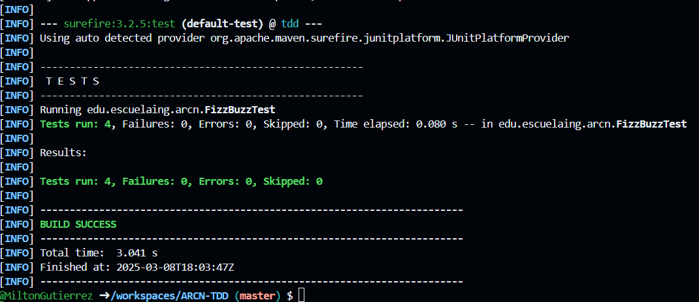

### Escuela Colombiana de Ingeniería

### ARCN - Arquitectura centrada en el negocio.

#  Taller TDD

Aplicar la metodología de Desarrollo Guiado por Pruebas (TDD) mediante la implementación del ejercicio clásico FizzBuzz en Java dentro de GitHub Codespaces.

## Empezando

Estas instrucciones te permitirán obtener una copia del proyecto y ejecutarlo en tu máquina local para propósitos de desarrollo y pruebas.

### Prerequisitos

- Java 21 preferiblemente.
- Maven 3.x
- Acceso a una terminal.

### Instalando

Pasos para configurar el entorno de desarrollo:

1. Clona el repositorio del proyecto:

   ```bash
   git clone https://github.com/MiltonGutierrez/ARCN-TDD
   cd ARCN-TDD
   ```
2. Compila el proyecto.

    ```bash
    mvn clean install
    ```

## Desarrollo del laboratorio.

Se creo el proyecto con el siguiente comando maven:
   ```bash
       mvn archetype:generate "-DgroupId=edu.escuelaing.arcn" "-DartifactId=tdd" "-DarchetypeArtifactId=maven-archetype-quickstart" "-DinteractiveMode=false"
   ```

Resultando en la siguiente estructura del proyecto:

    📂 src
    ├── 📂 main
    │   ├── 📂 java
    │   │   ├── 📂 edu
    │   │   │   ├── 📂 escuelaing
    │   │   │   │   ├── 📂 arcn
    │   │   │   │   │   ├── 📄 FizzBuzz.java
    ├── 📂 test
    │   ├── 📂 java
    │   │   ├── 📂 edu
    │   │   │   ├── 📂 escuelaing
    │   │   │   │   ├── 📂 arcn
    │   │   │   │   │   ├── 📄 FizzBuzzTest.java


### Clase FizzBuzzTest.java

Se implementaron las pruebas indicadas en la clase FizzBuzzTest resultando en:

   ```java
      class FizzBuzzTest {

            @Test
            void testFizzBuzzReturnsNumber() {
                assertEquals("1", FizzBuzz.fizzbuzz(1));
            }

            @Test
            void testFizzBuzzMultiplo3() {
                assertEquals("Fizz", FizzBuzz.fizzbuzz(3));
            }

            @Test
            void testFizzBuzzMultiplo5() {
                assertEquals("Buzz", FizzBuzz.fizzbuzz(5));
            }

            @Test
            void testFizzBuzzMultiplo3y5() {
                assertEquals("FizzBuzz", FizzBuzz.fizzbuzz(15));
            }
        }
   ```

Sin embargo recordemos que debemos seguir el patrón Triple A por lo que realizando esto resulta en: 

```java
    class FizzBuzzTest {

        @Test
        void testFizzBuzzReturnsNumber() {
            // Arrange
            int num = 1;
            String expected = "1";
            String result;
            // Act
            result = FizzBuzz.fizzbuzz(num);
            // Assert
            assertEquals(expected, result);
        }

        @Test
        void testFizzBuzzMultiplo3() {
            // Arrange
            int num = 3;
            String expected = "Fizz";
            String result;
            // Act
            result = FizzBuzz.fizzbuzz(num);
            // Assert
            assertEquals(expected, result);
        }

        @Test
        void testFizzBuzzMultiplo5() {
            // Arrange
            int num = 5;
            String expected = "Buzz";
            String result;
            // Act
            result = FizzBuzz.fizzbuzz(num);
            // Assert
            assertEquals(expected, result);
        }

        @Test
        void testFizzBuzzMultiplo3y5() {
            // Arrange
            int num = 15;
            String expected = "FizzBuzz";
            String result;
            // Act
            result = FizzBuzz.fizzbuzz(num);
            // Assert
            assertEquals(expected, result);
        }
    }
 ```

### Clase FizzBuzz.java

La implementación resultando (sin refactor) resultó en:

```java
        public class FizzBuzz{
            public static String fizzbuzz(int n) {
                StringBuilder fizzBuzzResult = new StringBuilder();
                if(n % 3 == 0){
                    fizzBuzzResult.append("Fizz");
                }
                if(n % 5 == 0){
                    fizzBuzzResult.append("Buzz");
                }
                return fizzBuzzResult.isEmpty() ? String.valueOf(n) : fizzBuzzResult.toString();
                
            }
        }
```

Al momento de refactorizar, se puede ver la logica que ejecutan los condicionales siempre se valida, por lo que podriamos crear unas funciones que se encarguen de realizar esto quedando así:

```java
        public class FizzBuzz{
            public static String fizzbuzz(int n) {
                StringBuilder fizzBuzzResult = new StringBuilder();
                fizz(n, fizzBuzzResult);
                buzz(n, fizzBuzzResult);
                return fizzBuzzResult.isEmpty() ? String.valueOf(n) : fizzBuzzResult.toString();
            }

            public static void fizz(int n, StringBuilder fizzBuzzResult){
                if(n % 3 == 0){
                    fizzBuzzResult.append("Fizz");
                }
            }

            public static void buzz(int n, StringBuilder fizzBuzzResult){
                if(n % 5 == 0){
                    fizzBuzzResult.append("Buzz");
                }
            }
        }
```
### Ejecución de pruebas

Al momento de ejecutar `mvn test` se prueba que la implementanción se realizó correctamente.



